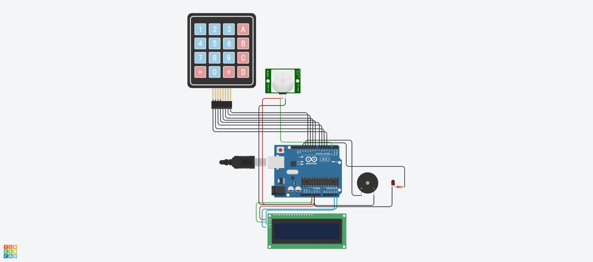

# Automata Riasztórendszer

<div align="center">


### 🔗 [▶ Tinkercad Szimuláció Megnyitása](https://www.tinkercad.com/things/lGVWRD1bFoh/editel?returnTo=%2Fdashboard&sharecode=e10EUwuSezz-bokL_V-uNGx4AJHEmUH73w_tv3J7cUM)

</div>

---

<div align="center">

| Készítette | Tantárgy | Környezet | Titkos kód |
|:---:|:---:|:---:|:---:|
| **AABMOW - Czeczó Krisztián** | Digitális Technika II. | Tinkercad Circuits | `1234` + `*` |

</div>

---

## A projekt

<div align="center">



*A kész riasztórendszer Tinkercad szimulációban*

</div>

---

## Fájlok

```
Arduino_Projekt_Digitalis_Technika_II/
│
├── riaszto.cpp        → Arduino forráskód (Wire.h, külső könyvtár nélkül)
├── Riaszto.brd       → Eagle board fájl
├── Riaszto.pdf       → Kapcsolási rajz PDF-ben
├── Riaszto.png       → Fotó a kész projektről
└── README.md          → Dokumentáció
```

| Fájl | Megnyitás |
|---|---|
| Kapcsolási rajz | [Riaszto.pdf](Riaszto.pdf) |
| Eagle board | [Riaszto.brd](Riaszto.brd) |
| Forráskód | [riaszto.cpp](riaszto.cpp) |

---

## A projekt célja

A beadandó célja egy **kódzárral védett automata riasztórendszer** elkészítése Tinkercad környezetben. A rendszer Arduino Uno vezérlőre épül, amely egy PIR mozgásérzékelő jelét dolgozza fel. A riasztó élesítése és hatástalanítása **4×4-es billentyűzettel és titkos kóddal** történik. Mozgás esetén **piezo szirén** és **villogó LED** jelez, az állapotokat **I2C LCD kijelző** mutatja.

### Megvalósított funkciók

| # | Funkció | Megvalósítás |
|:---:|---|---|
| 1 | Rendszer élesítése | Titkos kód (`1234`) + `*` gomb |
| 2 | Mozgásérzékelés | PIR HC-SR501 szenzor → D2 |
| 3 | Riasztó hang | `tone()` wee-woo szirén, 800–2000 Hz |
| 4 | Vizuális jelzés | Piros LED villog 200ms-onként |
| 5 | Hatástalanítás | `D` gomb → azonnali kikapcsolás |
| 6 | Állapot kijelzés | LCD 16×2 I2C, 3 állapot |

---

## Felhasznált alkatrészek

| Alkatrész | Darab | Feladat |
|---|:---:|---|
| Arduino Uno R3 | 1 | Központi vezérlő |
| PIR HC-SR501 | 1 | Mozgásérzékelő |
| 4×4 Keypad | 1 | Kódbevitel + hatástalanítás |
| LCD 16×2 I2C (PCF8574) | 1 | Állapot kijelzése |
| Piezo buzzer (passzív) | 1 | Szirénázó hang |
| Piros LED | 1 | Vizuális riasztás |
| 220 Ω ellenállás | 1 | LED áramkorlátozás |
| Breadboard + vezetékek | - | Összekötés |

---

## Pin kiosztás

```
Arduino Uno
│
├── D2  ────────── PIR OUT
├── D4  ────────── Keypad R1 (1. sor)
├── D5  ────────── Keypad R2 (2. sor)
├── D6  ────────── Keypad R3 (3. sor)
├── D7  ────────── Keypad R4 (4. sor)
├── D8  ────────── Keypad C1 (1. oszlop)
├── D9  ────────── Keypad C2 (2. oszlop)
├── D10 ────────── Keypad C3 (3. oszlop)
├── D11 ────────── Keypad C4 (4. oszlop)
├── D12 ────────── Buzzer +
├── D13 ────────── LED anód (220Ω-on át)
├── A4  ────────── LCD SDA
├── A5  ────────── LCD SCL
├── 5V  ────────── PIR VCC, LCD VCC
└── GND ────────── PIR GND, LCD GND, Buzzer –, LED katód
```

> **Fontos:** LCD I2C cím = `0x20` (PCF8574, 32 decimális)

---

## Működési elv

### Állapotgép

```
                    helyes kód + *
   ┌─────────────────────────────────────────┐
   │                                         ▼
[INAKTIV]                               [AKTIV]
   ▲                                         │
   │                                    PIR mozgás
   │                                         │
   └──────────── D gomb ◄──────────── [RIASZTAS]
                (bármikor)
```

### Állapottáblázat

| Állapot | LCD 1. sor | LCD 2. sor | 🔊 Buzzer | 💡 LED |
|:---:|---|---|:---:|:---:|
| INAKTIV | `  INAKTIV  ` | `Kod: ****` | ❌ | ❌ |
| AKTIV | `  AKTIV  ` | `Figyel [D=ki]` | ❌ | ❌ |
| RIASZTAS | `*** RIASZTAS ***` | `Mozgas! [D=stop]` | ✅ | ✅ |

### 🔑 Billentyűzet funkciók

| Gomb | Funkció |
|:---:|---|
| `1` `2` `3` `4` | Kód beírása |
| `*` | Megerősítés / élesítés |
| `#` | Beírt kód törlése |
| `D` | Azonnali hatástalanítás |

### 🔊 Szirén hangmintázat

```
Hz
2000 │        ╱╲
1600 │   ╱╲  ╱  ╲
1000 │  ╱  ╲╱    ────
 800 │ ╱
 600 │                ────
     └─────────────────────► idő
       wee  woo  gyors  mély
       400ms/fázis
```

---

## Forráskód

> Csak beépített `Wire.h` könyvtár — **semmilyen külső könyvtár nem szükséges!**

```cpp
// ============================================================
// Riasztórendszer - Tinkercad (NULLA külső könyvtár)
// Csak: Wire.h (beépített Arduino)
// ============================================================

#include <Wire.h>

#define LCD_ADDR      0x20
#define LCD_BACKLIGHT 0x08
#define LCD_EN        0x04
#define LCD_RW        0x02
#define LCD_RS        0x01

void lcdPulse(uint8_t data) {
  Wire.beginTransmission(LCD_ADDR);
  Wire.write(data | LCD_EN | LCD_BACKLIGHT);
  Wire.endTransmission();
  delayMicroseconds(1);
  Wire.beginTransmission(LCD_ADDR);
  Wire.write((data & ~LCD_EN) | LCD_BACKLIGHT);
  Wire.endTransmission();
  delayMicroseconds(50);
}

void lcdParancs(uint8_t cmd) {
  lcdPulse(cmd & 0xF0);
  lcdPulse((cmd << 4) & 0xF0);
  delay(2);
}

void lcdKarakter(char ch) {
  lcdPulse((ch & 0xF0) | LCD_RS);
  lcdPulse(((ch << 4) & 0xF0) | LCD_RS);
  delayMicroseconds(50);
}

void lcdInit() {
  delay(50);
  lcdPulse(0x30); delay(5);
  lcdPulse(0x30); delay(1);
  lcdPulse(0x30); delay(1);
  lcdPulse(0x20); delay(1);
  lcdParancs(0x28);
  lcdParancs(0x0C);
  lcdParancs(0x06);
  lcdParancs(0x01);
  delay(2);
}

void lcdClear() { lcdParancs(0x01); delay(2); }

void lcdKurzor(uint8_t sor, uint8_t oszlop) {
  lcdParancs((sor == 0) ? 0x80 + oszlop : 0xC0 + oszlop);
}

void lcdPrint(const char* szoveg) {
  for (int i = 0; szoveg[i] != '\0'; i++) lcdKarakter(szoveg[i]);
}

const int PIR_PIN    = 2;
const int BUZZER_PIN = 12;
const int LED_PIN    = 13;
const int ROW_PINS[4] = {4, 5, 6, 7};
const int COL_PINS[4] = {8, 9, 10, 11};

char keyMap[4][4] = {
  {'1','2','3','A'},
  {'4','5','6','B'},
  {'7','8','9','C'},
  {'*','0','#','D'}
};

const String HELYES_KOD = "1234";  // titkos kód: 1234 (lezárás: * gomb)

enum Allapot { INAKTIV, AKTIV, RIASZTAS };
Allapot allapot = INAKTIV;

String beirtKod = "";
unsigned long lcdIdeje = 0;
unsigned long hangIdeje = 0;
int hangFazis = 0;
bool ledAllapot = false;
unsigned long ledIdeje = 0;

void lcdFrissit();
void lcdHibas();
void allapotValt(Allapot uj);

char olvasKeypad() {
  for (int r = 0; r < 4; r++) {
    digitalWrite(ROW_PINS[r], LOW);
    for (int c = 0; c < 4; c++) {
      if (digitalRead(COL_PINS[c]) == LOW) {
        delay(50);
        while (digitalRead(COL_PINS[c]) == LOW);
        digitalWrite(ROW_PINS[r], HIGH);
        return keyMap[r][c];
      }
    }
    digitalWrite(ROW_PINS[r], HIGH);
  }
  return 0;
}

void riasztoHang() {
  unsigned long fazisEltelt = millis() - hangIdeje;
  if (fazisEltelt >= 400) {
    hangIdeje = millis();
    hangFazis = (hangFazis + 1) % 4;
    fazisEltelt = 0;
  }
  float arany = (float)fazisEltelt / 400.0;
  int freq;
  switch (hangFazis) {
    case 0: freq = 800  + (int)(800.0  * arany); break;
    case 1: freq = 1600 - (int)(800.0  * arany); break;
    case 2: freq = 1000 + (int)(1000.0 * arany); break;
    case 3: freq = 600;                           break;
    default: freq = 1000;
  }
  tone(BUZZER_PIN, freq);
  if (millis() - ledIdeje >= 200) {
    ledIdeje = millis();
    ledAllapot = !ledAllapot;
    digitalWrite(LED_PIN, ledAllapot ? HIGH : LOW);
  }
}

void setup() {
  Serial.begin(9600);
  Wire.begin();
  pinMode(PIR_PIN,    INPUT);
  pinMode(BUZZER_PIN, OUTPUT);
  pinMode(LED_PIN,    OUTPUT);
  digitalWrite(LED_PIN, LOW);
  noTone(BUZZER_PIN);
  for (int r = 0; r < 4; r++) { pinMode(ROW_PINS[r], OUTPUT); digitalWrite(ROW_PINS[r], HIGH); }
  for (int c = 0; c < 4; c++) { pinMode(COL_PINS[c], INPUT_PULLUP); }
  lcdInit();
  lcdFrissit();
  Serial.println("=== Riasztórendszer kesz ===");
}

void loop() {
  char bill = olvasKeypad();
  if (bill == 'D') { allapotValt(INAKTIV); return; }
  switch (allapot) {
    case INAKTIV:
      if (bill) {
        if (bill == '#') { beirtKod = ""; lcdFrissit(); }
        else if (bill == '*') {
          if (beirtKod == HELYES_KOD) { allapotValt(AKTIV); }
          else { lcdHibas(); delay(1200); beirtKod = ""; lcdFrissit(); }
        } else if (beirtKod.length() < 8) { beirtKod += bill; lcdFrissit(); }
      }
      break;
    case AKTIV:
      if (digitalRead(PIR_PIN) == HIGH) allapotValt(RIASZTAS);
      break;
    case RIASZTAS:
      riasztoHang();
      if (millis() - lcdIdeje >= 800) { lcdIdeje = millis(); lcdFrissit(); }
      break;
  }
}

void allapotValt(Allapot uj) {
  allapot = uj; beirtKod = "";
  noTone(BUZZER_PIN); digitalWrite(LED_PIN, LOW);
  hangFazis = 0; hangIdeje = millis();
  lcdFrissit();
  switch (uj) {
    case INAKTIV:  Serial.println(">> INAKTIV");  break;
    case AKTIV:    Serial.println(">> AKTIV");    break;
    case RIASZTAS: Serial.println(">> RIASZTAS"); break;
  }
}

void lcdFrissit() {
  lcdClear();
  switch (allapot) {
    case INAKTIV:
      lcdKurzor(0,0); lcdPrint("  INAKTIV       ");
      lcdKurzor(1,0);
      if (beirtKod.length() == 0) { lcdPrint("Kod: _          "); }
      else {
        char sor[17] = "Kod: ";
        for (unsigned int i = 0; i < beirtKod.length() && i < 11; i++) { sor[5+i]='*'; sor[6+i]='\0'; }
        lcdPrint(sor);
      }
      break;
    case AKTIV:
      lcdKurzor(0,0); lcdPrint("  AKTIV         ");
      lcdKurzor(1,0); lcdPrint("Figyel [D=ki]   ");
      break;
    case RIASZTAS:
      lcdKurzor(0,0); lcdPrint("*** RIASZTAS ***");
      lcdKurzor(1,0); lcdPrint("Mozgas! [D=stop]");
      break;
  }
}

void lcdHibas() {
  lcdClear();
  lcdKurzor(0,0); lcdPrint("  Hibas kod!    ");
  lcdKurzor(1,0); lcdPrint("  Probald ujra  ");
}
```

---

## Tesztelés

### Lépések

1. Szimuláció indítása — **Start Simulation** gomb
2. Serial Monitor megnyitása
3. Keypadon `1` `2` `3` `4` begépelése, majd `*` → **AKTIV**
4. PIR szenzorra kattintás → **RIASZTAS**
5. Buzzer szirénázás + LED villogás ellenőrzése
6. `D` gomb → **INAKTIV** visszaállás

### Elvárt eredmények

| Tesztlépés | Elvárt működés | Eredmény |
|---|---|:---:|
| Helyes kód + `*` | LCD: AKTIV, Serial: `>> AKTIV` | ✅ |
| Rossz kód + `*` | LCD: Hibas kod!, 1.2s után visszaáll | ✅ |
| PIR mozgás (AKTIV-ban) | Szirén + LED villog | ✅ |
| `D` gomb | Minden leáll, LCD: INAKTIV | ✅ |
| `#` gomb | Beírt kód törlődik | ✅ |

---

## Hibakeresés

| Hiba | Megoldás |
|---|---|
| LCD nem jelenít meg semmit | I2C cím: `0x20` helyes-e? SDA→A4, SCL→A5? |
| Keypad nem reagál | `INPUT_PULLUP` beállítva? D4–D11 bekötve? |
| Buzzer nem szól | **Passzív** buzzer kell `tone()`-hoz! D12 bekötve? |
| PIR mindig 0 | Tinkercadben kattints a szenzorra! |
| Fordítási hiba | Csak `Wire.h` kell — más könyvtár nem! |

---

## Összegzés

A projekt bemutatja:

| Fogalom | Megvalósítás |
|---|---|
| Állapotgép | INAKTIV → AKTIV → RIASZTAS |
| I2C kommunikáció | LCD vezérlés könyvtár nélkül |
| Hangszintézis | `tone()` frekvenciasöprés |
| Mátrix szkennelés | 4×4 keypad könyvtár nélkül |
| Nem blokkoló kód | `millis()` alapú időzítés |

### Ellenőrzőlista leadás előtt

- [ ] PIR OUT → D2
- [ ] Keypad 8 láb → D4–D11
- [ ] Buzzer + → D12, – → GND
- [ ] LED anód → 220Ω → D13, katód → GND
- [ ] LCD SDA → A4, SCL → A5, cím: `0x20`
- [ ] Helyes kód (`1234` + `*`) → AKTIV állapot
- [ ] PIR mozgás → szirén + LED villog
- [ ] `D` gomb → INAKTIV visszaállás

---

<div align="center">

**AABMOW - Czeczó Krisztián** | Digitális Technika II.


</div>
